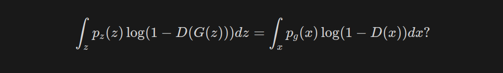

# Generative Adversarial Networks:


An unsupervised model called a generative adversarial network, or GAN, seeks to produce new samples that are identical to a collection of training examples.

The fundamental concept is straightforward: by mapping random noise to the input data distribution. The primary network or Generator creates samples. The samples must be realistic if a second network or Discriminator is unable to distinguish between the generated samples and the real ones. Although the concept is straightforward, it can be challenging to train GAN because the learning process can be unstable and even if they may learn to generate realistic samples, this does not necessarily mean that they also learn to generate all potential samples.

The generator and discriminator in a GAN are two neural networks that are jointly trained in a way that is similar to playing a game.

The task of the generator is to new data that resembles the training data. It turns input random noise into output distribution that ought to resemble the training data. In an image generation task, for instance, the generator uses random noise as input and outputs an image that resembles the distribution of the training images.

On the other hand, the discriminator is in charge of separating created data from genuine data. It accepts data as input and outputs a binary result that indicates whether the input is true or false. In our example of image production, the discriminator receives a picture as input and outputs either 0 or 1 depending on whether it is a fake or a real image from the training set (i.e., generated by the generator).

The generator and discriminator are trained in alternating rounds during training. The discriminator is trained using both real and false data after the generator produces a batch of fake data. Whereas the generator's objective is to produce data that can deceive the discriminator into identifying it as real, the discriminator's objective is to accurately distinguish between actual and fake data.

By this process of alternate training, the discriminator improves their ability to tell the difference between real and fake data, while the generator learns to make data that resembles the training data.

**Train the Discriminator :** 


  

1.  First, get a random real example x from the given training dataset.
2. Now get a new random vector z and, utilizing the generator network, synthesize a
fake example as x*.
3. Utilize the discriminator network to distinguish between x* and x.
4. Find the classification error and back-propagate. we don't want change the parameters of generator when we are  updating the discriminator. so we detach Generators gradient.Then try to minimize the classification error to update the discriminator biases and weight.

**Train the Generator:**


1. First create a new image from the noise vector z using a generator to create a fake example as x*.
2.  Use a discriminator to categorize real and fake examples.
3. Find the classification error and back-propagate. Then try to minimize the classifi-
cation error due to which the total error to renovate the discriminator biases and
weight

As per the original GAN paper, the loss function for GAN is as below

<p align="center" >
    
</p>
## Derivation of the loss:

Before we go into the derivation, let’s describe some parameters and variables: 

<p align="center" >
    
</p>


The loss function described in the original paper by Ian Goodfellow et al. can be derived from the formula of binary cross-entropy loss.


<p align="center" >
    
</p>
### Discriminator Loss:

The discriminator can have two possible inputs, real or fake.

While training the discriminator, the label of data coming from the $x_{real}$ is $y = 1$  and $\hat y = D(x)$. Then, equation 2 becomes: 

<p align="center" >
    
</p>
While training data is coming form generator, $y = 0$ and $\hat y = D(G(z))$. Then, equation 2 becomes: 

<p align="center" >
    
</p>

Combining both the above losses for the discriminator, one for a real input and the other for a fake input: 

<p align="center" >
    
</p>

Here, The goal of the discriminator is to minimize this loss so equation(5) becomes: 

<p align="center" >
    
</p>

**Min** will become **max** when the negative sign is removed, hence the final discriminator loss for a single data-point can be expressed as: 


<p align="center" >
    
</p>
### Generator loss:

Here, the generator is competing against discriminator. So, it will try to minimize the equation (7) and loss function is given as,

<p align="center" >
    
</p>
### **Combined loss function :**

Lets combine equation (7) and equation (8) : 


<p align="center" >
    
</p>

As the aforementioned loss function only applies to a single data point, we must interpret the expectation of the aforementioned equation as: 

<p align="center" >
    
</p>
### **What is the optimal value for D?**

The training criterion of discriminator D, given any generator G is to maximize equation (10). Hence, the optimal discriminator for a given G is denoted as : 


<p align="center" >
    
</p>
We know that: 

<p align="center" >
    
</p>
Applying equation (12) to equation (13): 

<p align="center" >
    
</p>

**But, in the paper it is written as:** 


<p align="center" >
    
</p>

Now lets understand the following and we will jump back to equation(15): 


<p align="center" >
    
</p>

If the probability density function of a random variable X is given as $p_x(x)$, it is possible to calculate the probability density function of some variable $y = G(x)$ and is defined as change of variable:  


<p align="center" >
    
</p>
So, in our case: 


<p align="center" >
    
</p>
Here, 

<p align="center" >
    
</p>

Assume $G$  is invertible, so $z = G^{-1}(x)$. Lets start from left side of the equation 15: 

<p align="center" >
    
</p>

Now, from equation 15 : 

<p align="center" >
    
</p>

The goal of the discriminator is to maximize this value function(18). Through a partial derivative of  $V(G,D)$ respect to $D(x)$  we see that the optimal discriminator, denoted as $D^*(x)$ occurs when 


<p align="center" >
    
</p>

Here, $D_G^*(x)=\frac{p_{\text {data }}(x)}{p_{\text {data }}(x)+p_g(x)}$ makes intuitive sense. if some sample $x$ is highly genuine, we would expect $p_{data}(x)$ to be close to 1 and $p_g(x)$ to be converge to 0, in which case the optimal discriminator would  assign 1 to that sample. On the other hand, for a generated sample $x=G(z)$, we expect the optimal discriminator to assign a label of zero, since $p_{data}(G(z))$ should be close to zero.

## Limitation of GAN :

1. **Mode collapse**
    
    When both of these objectives are met, a GAN has been successfully trained.
    
    1. Generator produces data that can deceive the Discriminator.
    2. The generator generates data samples that are as diverse as the distribution of the real-world data.
    
    When the generator is unable to accomplish Goal #2 and all of the samples it generates are extremely similar or identical, mode collapse occurs.The generator may “win” by creating one realistic data sample that always fools the discriminator–achieving Goal #1 by sacrificing Goal #2.
    
2. **Vanishing Gradient**
    
    Generator training may not succeed if your discriminator is too effective because of diminishing gradients. In effect, an optimum discriminator doesn't give the generator enough data to advance. The chain rule of differentiation, which has a multiplying effect, is used when we employ back-propagation. As a result, the gradient moves downward from the top layer to the bottom layer. It grows smaller as it flows in the opposite direction. In some cases, the gradient is so tiny that the initial layers either stop learning altogether or learn very slowly.
    

1. **Hard to find Nash equilibrium** 
    
    The zero-sum non-cooperative game is the foundation of GAN. Short version: If one wins, the other loses. When a player refuses to alter their behavior regardless of what the opponent may do, this situation is known as a Nash equilibrium. To better comprehend why it is challenging to locate a Nash equilibrium in a non-cooperative game, let us look at a straightforward example.
    
    Suppose one player takes control of $x$ to minimize$f_1(x) = xy$ , while at the same time the other player $y$ constantly updates to minimize $f_2(y) = - xy$.  x=y=0 is the Nash equilibrium. Only in this situation your opponent's behavior not matter.
    
    Because $\frac {df_1}{dx} = y$ and $\frac {df_2}{dy} = - x$, we update $x$  with $x - \eta . y$ and $y + \eta . x$ with simultaneously in one iteration, where is the learning rate. Once $x$ and $y$ have different signs, every following gradient update causes huge oscillation and the instability gets worse in time, as shown in Fig
    
   
    <p align="center" >
    
    </p>
    ### ****Why are GANs hard to train?****
    
    These issues arise because the ideal weights for adversarial networks correspond to saddle points rather than loss function minimization. Often employed alternating stochastic gradient algorithms do not consistently converge to saddle points, and when they do, they are frequently quite sensitive to learning rates.
    
    


    
    ## Creating your own GAN:

        <p align="center" >
    
    </p>
    
    ```jsx
    import cv2 
    import torch
    import numpy as np 
    import torch.nn as nn 
    from torchvision import transforms
    from torch.utils.data import DataLoader
    
    from torchvision.datasets import MNIST
    from torchvision.utils import make_grid
    import matplotlib.pyplot as plt 
    
    from tqdm.auto import tqdm
    ```
    
    ```jsx
    def show(tensor,epoch ,channel = 1 , size = (28,28), num = 16 ):
    
        # tensor : 128 * 28 * 28
        data=tensor.detach().cpu().view(-1,channel,*size) #-> 128,1,28,28
        grid = make_grid(data[:num], nrow= 4).permute(1,2,0)# 1X28X28 -> 28x28x1
        plt.imshow(grid)
        # plt.show()
        plt.savefig(f"mnist_generated/{epoch}.png")
    ```
    
    ```jsx
    # hyperparameters and parameters: 
    EPOCHS = 500
    BATCH_SIZE = 256
    DEVICE = "cuda" if torch.cuda.is_available() else "cpu"
    
    current_step = 0
    info_step = 500 # step to visualize the data 
    
    mean_gen_loss = 0
    mean_disc_loss = 0
    
    z_dim = 64 # dim of noise vector 
    lr = 0.0001
    loss_fn = nn.BCEWithLogitsLoss()
    
    # mnist dataloder
    dataloader = DataLoader(MNIST('.',download=True, transform= transforms.ToTensor()), shuffle= True, batch_size=BATCH_SIZE)
    ```
    
    **The Generator:**
    
    ```jsx
    # The generator 
    def genBlock(inp, out):
        return nn.Sequential(
            nn.Linear(inp, out),
            nn.BatchNorm1d(out),
            nn.ReLU(inplace=True)
        )
    
    class Generator(nn.Module):
        def __init__(self, z_dim=64, i_dim=784, h_dim=128):
            super().__init__()
            self.gen = nn.Sequential(
                genBlock(z_dim, h_dim), # 64, 128
                genBlock(h_dim, h_dim*2), # 128, 256
                genBlock(h_dim*2, h_dim*4), # 256 x 512
                genBlock(h_dim*4, h_dim*8), # 512, 1024
                nn.Linear(h_dim*8, i_dim), # 1024, 784 (28x28)
                nn.Sigmoid(),
            )
    
        def forward(self, noise):
            return self.gen(noise)
    
    # Random Noise Generator
    def gen_noise(number, z_dim):
        return torch.randn(number, z_dim).to(DEVICE)
    ```
    
    **The Discriminator:**
    
    ```jsx
    # The discriminator 
    
    def disc_block(inp , opt):
    
        return nn.Sequential(
            nn.Linear(in_features=inp, out_features= opt),
            nn.LeakyReLU(0.2)
        )
    
    class Discriminator(nn.Module):
        def __init__(self, i_dim = 784 , h_dim = 128) -> None:
            super().__init__()
    
            self.disc = nn.Sequential(
                disc_block(i_dim , h_dim * 4),
                disc_block(h_dim * 4 , h_dim * 2 ),
                disc_block(h_dim * 2 , h_dim),
                nn.Linear(h_dim  , 1)
            )
        
        def forward(self, noise):
            return self.disc(noise)
    ```
    
    ```jsx
    gen = Generator(z_dim).to(DEVICE)
    gen_opt  = torch.optim.Adam(params= gen.parameters(), lr = lr)
    
    disc = Discriminator().to(DEVICE)
    disc_opt = torch.optim.Adam(params= disc.parameters(), lr = lr)
    ```
    
    **Visualizing the noise:**
    
    ```jsx
    x,y = next(iter(dataloader))
    print(x.shape,y.shape)
    print(y[:10])
    
    nosie = gen_noise(BATCH_SIZE ,z_dim)
    fake = gen(nosie)
    
    show(fake,'noise')
    ```
    
    
    
    **🧠🧠The loss functions 🧠🧠:**
    
    ```jsx
    # calclaute the loss 
    
    def cal_gen_loss(loss_fn , gen , disc, number, z_dim):
        noise = gen_noise(number, z_dim)
        fake = gen(noise)
        pred = disc(fake)
    
        targets = torch.ones_like(pred)
        generator_loss = loss_fn(pred,targets)
    
        return generator_loss
    
    def cal_disc_loss(loss_fn, gen, disc, number, real, z_dim):
    
        noise = gen_noise(number , z_dim)
        fake = gen(noise)
        
        # we dont want change the parameters of generator when we are 
        # upadating the discriminator. so we detach.
        disc_fake = disc(fake.detach() )
        disc_fake_targets = torch.zeros_like(disc_fake)
        disc_fake_loss = loss_fn(disc_fake, disc_fake_targets)
    
        disc_real = disc(real)
        disc_real_targets = torch.ones_like(disc_real)
        disc_real_loss = loss_fn(disc_real, disc_real_targets)
    
        disc_loss = (disc_fake_loss + disc_real_loss) / 2 
    
        return disc_loss
    ```
    
    **Train Train Train :** 
    
    ```jsx
    # Trainig loop: 
    gen_loss_list = []
    disc_loss_list = []
    for epoch in range(EPOCHS):
        print(f"Epoch : {epoch + 1 } / {EPOCHS}")
        # print(f"{epoch+1}/{EPOCHS}")
        iterations = 0
        gen_iter_loss = 0.0
        disc_iter_loss = 0.0
        train_bar = tqdm(dataloader, desc=f"Training")
        for batch_idx, (real, _) in enumerate(train_bar):
    
            ### discriminator 
            disc_opt.zero_grad()
    
            current_batch_size = len(real) # BATCH_SIZE 128X1X28X28
            real = real.view(current_batch_size , -1 ) # BATCH_SIZE * 728
            real = real.to(DEVICE)
            disc_loss = cal_disc_loss(loss_fn, gen , disc, current_batch_size, real , z_dim)
    
            disc_loss.backward(retain_graph = True)
            disc_opt.step()
    
            ### generator 
            gen_opt.zero_grad()
            gen_loss = cal_gen_loss(loss_fn,gen, disc,current_batch_size, z_dim )
            gen_loss.backward(retain_graph = True)
            gen_opt.step()
    
            ### visualization
            gen_iter_loss += disc_loss.item()
            disc_iter_loss += gen_loss.item() 
    
            iterations+=1
            train_bar.set_postfix(
                gen_loss = gen_iter_loss/( batch_idx + 1), 
                disc_loss = disc_iter_loss / (batch_idx + 1 )
            )
    
        gen_loss_list.append(gen_iter_loss/iterations)
        disc_loss_list.append(disc_iter_loss/iterations)
        if epoch % 5 == 0:
            print(f"Epoch:{epoch}: / Gen loss: {gen_loss_list[-1]} / disc_loss: {disc_loss_list[-1]}")
            fake_noise = gen_noise(current_batch_size, z_dim)
            fake = gen(fake_noise)
            show(fake , epoch)
    ```
    
    References: 
    
    - [https://towardsdatascience.com/the-math-behind-gans-generative-adversarial-networks-3828f3469d9c](https://towardsdatascience.com/the-math-behind-gans-generative-adversarial-networks-3828f3469d9c)
    - [https://medium.com/deep-math-machine-learning-ai/ch-14-general-adversarial-networks-gans-with-math-1318faf46b43](https://medium.com/deep-math-machine-learning-ai/ch-14-general-adversarial-networks-gans-with-math-1318faf46b43)
    - [https://jaketae.github.io/study/gan-math/](https://jaketae.github.io/study/gan-math/)
    - [https://www.cs.umd.edu/~tomg/projects/stable_gans/](https://www.cs.umd.edu/~tomg/projects/stable_gans/)
    - [https://jonathan-hui.medium.com/gan-why-it-is-so-hard-to-train-generative-advisory-networks-819a86b3750b](https://jonathan-hui.medium.com/gan-why-it-is-so-hard-to-train-generative-advisory-networks-819a86b3750b)